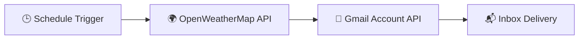

# 🌦️ Automated Daily Weather Email Notifier

A production-ready low-code automation workflow built using **n8n** that fetches current weather metadata for Delhi, India, and dispatches an automated HTML summaries/alerts directly to your inbox via the **Gmail API**.

---

## 🚀 How It Works

1. **Schedule Trigger:** Fires automatically at your preferred designated intervals.
2. **Weather API Fetch:** Calls OpenWeatherMap using localized Indian PIN codes (`110001,in`).
3. **Data Transformation:** Parses dynamic JSON structures (Temperature, Wind Speed, Humidity).
4. **Gmail Integration:** Formats data string maps into clean email bodies and fires them off via OAuth2.

---

## 🛠️ Tech Stack & Integrations

*   **Automation Platform:** [n8n](https://n8n.io) (Self-Hosted / Cloud)
*   **Data Source:** [OpenWeatherMap Current Weather API](https://openweathermap.org)
*   **Authentication Protocol:** Google Cloud Console OAuth 2.0 Identity Platform
*   **Email Deliverability Gateway:** [Google Gmail REST API](https://google.com)

---

## 📦 Installation & Setup

### 1. Prerequisites
*   A running instance of n8n.
*   A free [OpenWeatherMap API Key](https://openweathermap.org).
*   A Google Cloud Project with the **Gmail API** enabled and your email added under **Test Users**.

### 2. Import into n8n
1. Copy the contents of the `My_Workflow.json` file from this repository.
2. Open your n8n workspace canvas.
3. Use the keyboard shortcut `Ctrl + V` (or `Cmd + V` on Mac) to paste the workflow directly onto your screen.

### 3. Environment Variables & Constants
Ensure your node properties match the following settings:
*   **OpenWeatherMap Location Mode:** `Zip Code`
*   **Zip Code Value:** `110001,in`
*   **Gmail Authorized Redirect URI:** `http://localhost:5678/rest/oauth2-credential/callback`

---

## 🔒 Credentials & Security Best Practices
To keep this project safe:
*   **Never commit active tokens:** API keys and Google Client Secrets are separated automatically within n8n's database layer. Do not hardcode them into the node expressions.
*   **Keep App in Testing:** Keeping your Google Cloud project configuration in the *Testing* audience lifecycle limits credential exposures without needing full public validation checklists.

---

## 📝 License
Distributed under the MIT License. See `LICENSE` for more information.
